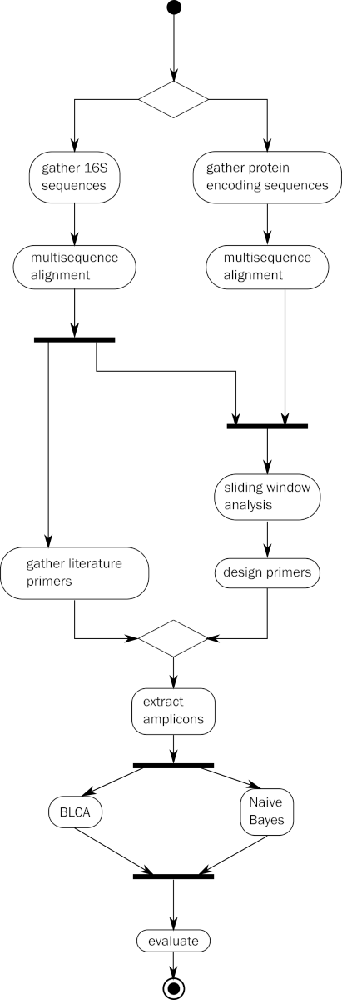

# Introduction

The human bladder was long believed to be a sterile environment, except
for acute infections. However, evidence from sequenced-based and
enhanced culturing techniques have revealed the bladder supports a
population of bacteria even in the absence of infection. The discovery
of a bladder microbiota naturally leads to the question of how it
influences the health of the host, and recent clinical studies
collectively provide evidence that understanding changes in the
bacterial diversity and abundance of the bladder microbiota is relevant
and warrants further investigation.

Bacterial identification depends on comparing the DNA sequence obtained
from the collected bacteria with information held in a phylogenetic
database, using an algorithm to perform the comparison. Together, these
components are called a classification scheme. A common classification
scheme is composed of the V4 region of the 16S rRNA gene, the Silva
database, and Naive Bayes classifier. Currently, the phylogenetic
resolution achieved with this classification scheme is limited to the
Genus level, and obscures the true nature of the relation between
bacterial species found in the bladder and the host.

The 16S rRNA gene is not the only gene suitable for identifying bacteria
in a collected sample. Additional genes that have experienced different
selective pressure and have accumulated a different diversity of DNA
mutations may provide better taxonomic resolution for the bacteria found
in the human bladder. Likewise, there are more classifiers than just
Naive Bayes, and more databases than just Silva. Combining these
additional resources into new classification schemes can increase the
phylogenetic resolution.

# overview

This study was done in two parts. The first part computationally
compares the phylogenetic resolution that is achieved by combining 4
currently available databases, 2 taxonomic classifiers, and subsequences
from 3 genes into 58 classification schemes.

The second part of the study was to validate one of the classification
schemes by comparing the computational outcome with data generated from
targeted amplicon sequencing of bacterial DNA obtained from urine
samples.

This repository contains the coding resources that were used in
producing the results of the thesis (manuscript?) divided into 5
sections.

  - gathering the sequences used in the study
  - extracting the predicted subsequences using primer annealing sites
    as coordinates (targeted amplicons)
  - identification of the targeted amplicons using all classification
    schemes
  - evaluation of the results

The general workflow is illustrated below

