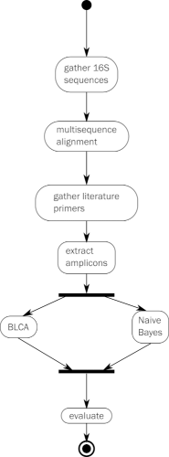

This repository contains the coding resources that were used in
producing the results of the manuscript divided into 5 sections.

  - gathering the sequences used in the study  
  - extracting the predicted subsequences using primer annealing sites
    as coordinates (targeted amplicons)  
  - identification of the targeted amplicons using all classification
    schemes  
  - evaluation of the results

This study was done in two parts. The first part computationally
compares the phylogenetic resolution that is achieved by combining 4
currently available databases, 2 taxonomic classifiers, and subsequences
from 3 genes into 58 classification schemes.

The second part of the study was to validate one of the classification
schemes by comparing the computational outcome with data generated from
targeted amplicon sequencing of bacterial DNA obtained from urine
samples.

The general workflow is illustrated below

