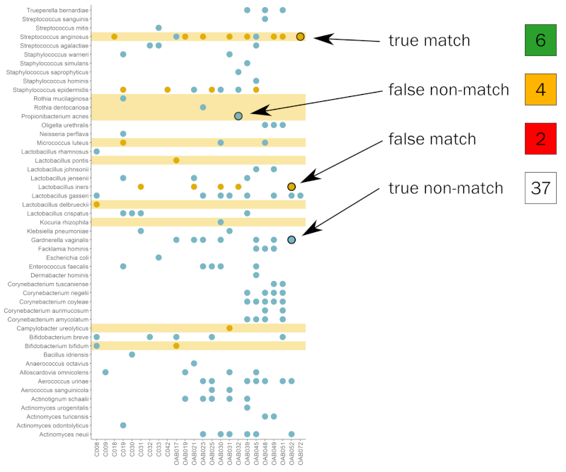
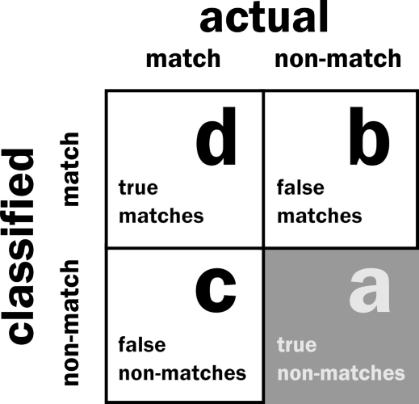
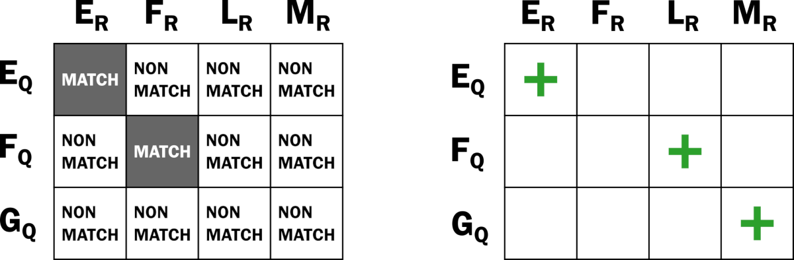
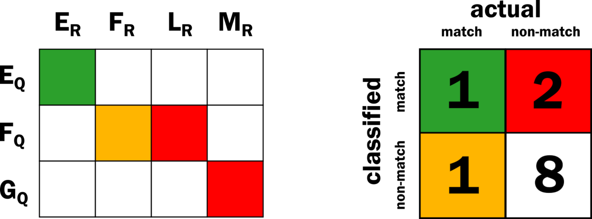
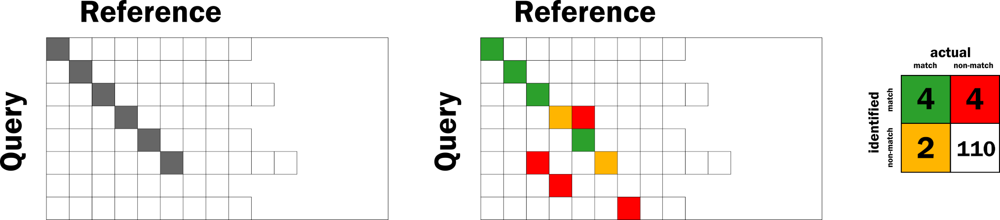
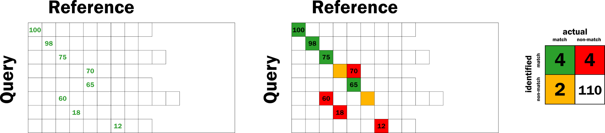
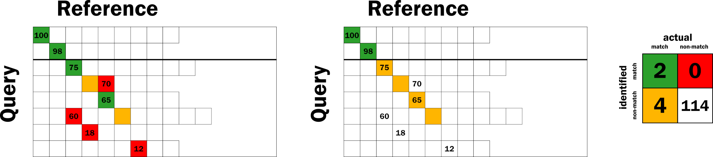
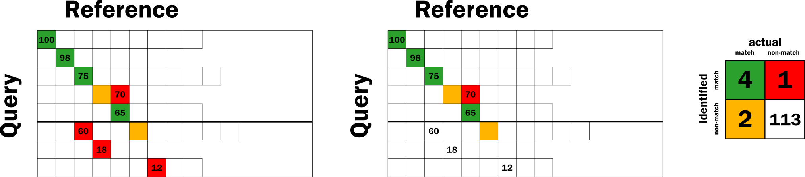

```{r, eval=FALSE, echo=FALSE}
output: 
  pdf_document:
      toc: true
      toc_depth: 2
      df_print: kable
    
output: 
  html_document:
    toc: true
    toc_depth: 4
    toc_float: true
    theme: readable
    highlight: tango

# knit directly to md for github
output:
  md_document:
    variant: gfm
```


```{r echo=FALSE}
knitr::opts_chunk$set(tidy = FALSE, warning = FALSE, message = FALSE, max.print = 5)
```

```{r echo=FALSE}
# load libraries
library(tidyverse)

```

# evaluating identification results

This part of the project relied more on how terms are defined, as opposed to the straightforward amount of number-crunching that occured upstream. The section on Record Linkage is included here because "confusion matrix" is a well deserved title, and it helps to have explanations with lots of pictures.

All evaluations and effects of confidence scores were processed by the function `f1_records()` in the `central_evaluation.R` script.

# evaluating computational results

The computational identification results are held in a CSV file that contains the sequence ID, the species of the extracted amplicon (the query record), the species name (the database record) assigned by BLCA or Naive Bayes, the confidence score, and if the names of the query and database records are a match. A "match" is designated by a 1, "non-match" is designated by a 0. Some examples are listed in the table below.


|id | query | blca | confidence | match |
|-----------------|-----------------|-----------------|-----------------|-----------------|
|AB618790.1.1522 | Actinomyces naeslundii | Actinomyces naeslundii | 89.5603174603 | 1|
|AB920570.1.1436 | Gordonia terrae | Gordonia terrae | 45.3428973201 | 1|
|AF003929.1.1520 | Streptococcus mitis | Streptococcus oralis | 36.5655094905 | 0|
|AF133538.1.1486 | Oligella urethralis | Oligella urethralis | 100.0 | 1|

The results are then assigned as true matches, false matches and false non-matches according to the following definitions: 

  * True match - All record pairs assigned as a match that have identical genus and species labels.
  
  * False match - All record pairs assigned as a match that did not have identical genus and species labels.
  
  * False non-match - If a record representing a species in the Thomas-White dataset was present in the database, but was not assigned as a match, the record was evaluated as a false non-match. 
  
  * True non-match - All records in the reference database that were not in the Thomas-White dataset. While records assigned to this category were not used in evaluating the classification schemes in this manuscript, the definition is still included for completeness.
  
While true matches and false matches are easy, the false non-matches are a little tricky. There are only two ways for a false non-match to occur:

   1. a known true match is missed and another record is assigned as a match
   
   2. a true match that is below the confidence score threshold
  
How can you tell when the classification algorithm has missed a true match? By making a list of all the species that are absent from the reference database, and then checking the species name of the query against this list when the value in the match column is 0. In the example above, _Streptococcus mitis_ was identified as _Streptococcus oralis_. During evaluation, the function `f1_records()` checks _Streptococcus mitis_ against a list of the species that are missing from the particular database used by the classification scheme. If the species is truly missing, then no false non-match is recorded, because there is no way for the classification scheme to make a correct identification.


# evaluating the validation results

As described in their paper, Thomas-White et al obtained urine samples from 77 female subjects with and without symptoms of overactive bladder[^1]. Each urine sample was cultured by expanded quantitative urine culture (EQUC), the successfully cultured bacteria isolated, and whole genome sequencing performed on the isolates. The list of bacteria species found in each sample was obtained from the supplementary information.

Targeted amplicon sequences of a set of those urine samples, using the V4 region of the 16S rRNA gene sequence, was generously provided by Alan Wolfe. The raw sequence reads were processed with DADA2 (v. 1.14.1)[^2] to generate amplicon sequence variants (ASVs). 

The whole genome sequencing was considered more accurate, and those results were used as the "actual" bacterial identity. They're the columns in the confusion matrix. The V4 sequencing was used as the identifier for the six classification schemes we used to validate our findings. These would be the rows of the confusion matrix. The remaining components of these classification schemes were the NCBI 16S, Silva, and Greengenes databases, and the Naive Bayes and BLCA classification algorithms.

[^1]: Thomas-White K, Forster SC, Kumar N, Kuiken MV, Putonti C, Stares MD, et al. Culturing of female bladder bacteria reveals an interconnected urogenital microbiota. Nature Communications. 2018 Apr 19;9(1):1557. 

[^2]: Callahan BJ, McMurdie PJ, Rosen MJ, Han AW, Johnson AJA, Holmes SP. DADA2: High-resolution sample inference from Illumina amplicon data. Nature Methods. 2016 Jul;13(7):581–3. 


## confusion matrix definitions

The whole genome sequencing (WGS) results were considered which bacteria are present in each urine sample. The computational results were compared to the WGS results, and used to designate how well a given classification scheme could be expected to perform. Some classification schemes would identify all the species identified through WGS, and some would identify very few. 

The V4 sequencing results were compared to the computational results to validate those expectations. Some of the classification schemes using the V4 identifier were able to identify as many species as the computational results, and some did not. These comparisons led to the following definitions on how to fill out the confusion matrix.

  * True match - All matches from the computational classification scheme that were correctly identified by V4 16S targeted amplicon sequencing
  
  * False match - All species identified by V4 16S targeted amplicon sequencing that were not identified by the computational classification scheme
  
  * False non-match - All matches from the computational classification scheme that were not identified by V4 16S targeted amplicon sequencing
  
  * True non-match - All species that were not identified by either the computational classification schemes or the V4 16S targeted amplicon sequencing

## reformatting results

We bundled the identification results, the sample names of the V4 sequencing, and the ASVs into a Phyloseq object[^3]. Because all the classification schemes used the same identifier, we ended up with six Phyloseq objects for each combination of classification algorithm and database.

```
Formal class 'phyloseq' [package "phyloseq"] with 5 slots
  ..@ otu_table:Formal class 'otu_table' [package "phyloseq"] with 2 slots
  ..@ tax_table:Formal class 'taxonomyTable' [package "phyloseq"] with 1 slot
  ..@ sam_data :'data.frame':	57 obs. of  4 variables:
Formal class 'sample_data' [package "phyloseq"] with 4 slots
  ..@ phy_tree : NULL
  ..@ refseq   : NULL
```

The `otu_table` slot holds the ASVs from the DADA2 processing. The `tax_table` slot are the results from BLCA or Naive Bayes. And lastly, the `sam_data` holds the names of the urine samples collected.

[^3]: McMurdie PJ, Holmes S. phyloseq: An R Package for Reproducible Interactive Analysis and Graphics of Microbiome Census Data. PLOS ONE. 2013 Apr 22;8(4):e61217. 


## merging results

The graphs and calculations for precision, recall, and accuracy, were generated by merging the classification schemes into a dataframe that contained all results from either BLCA or Naive Bayes. The merging was done by first converting the results into a matrix, and then performing some linear algebra (addition). 

So, for example, suppose there are two sets of results. Each set represents a comparison between the actual and predicted identifications. 


```{r, echo=FALSE}
data_set_a <- matrix(data=c(0,1,1,1,0,0), nrow=3, ncol=2)
data_set_b <- matrix(data=c(2,2,0,2,0,2), nrow=3, ncol=2)
```

```
data_set_a <- matrix(data=c(0,1,1,1,0,0), nrow=3, ncol=2)
data_set_b <- matrix(data=c(2,2,0,2,0,2), nrow=3, ncol=2)
```

These comparisons are basically a match/non-match outcome and can be represented by 1 or 0. 


```{r}
data_set_a
```

But the '1' can be any integer. To combine two sets of results, one dataframe can use the 1/0 designations, and the other can use a 2/0 designation. 

```{r}
data_set_b
```

When those results are overlaid on each other and added, you get a range of values from 0 to 3.

```{r}
data_set_a + data_set_b
```

The validation results were evaluated and graphed in this manner. 0 would indicate that a species is absent in the sample. 1 would indicate that WGS identified that species in the sample and 2 would indicate that V4 seqeuncing identified the species in that sample. 3 would indicate that both methods identified the species in that sample.

The graph below is a summary of how the comparison between the V4 sequencing and computational results assigns the identifications to what cell of the confusion matrix. The light yellow rows indicate the species correctly identified by the computational classification scheme. Blue dots represent species identified in the collected samples by WGS. Yellow dots indicate the species were identified in those samples by V4 targeted amplicon sequencing. Yellow dots in light yellow rows are true matches, when found elsewhere they are false matches. Blue dots in the light yellow rows are false non-matches, when found elsewhere they are true non-matches.



### precision, recall and accuracy

The precision, recall and accuracy of the V4 validation classification schemes were calculated based on 


# record linkage

Assigning species level taxonomy to a bacterial sequence is considered a type of record linkage. In this paradigm, the unknown bacterial sequence (the _identifier_) is compared against sequences in a reference database (the _database_) by a classification algorithm (the _classifier_, such as Naive Bayes or BLCA) until a match is found. These three components are called the _classification scheme_. An example of a classification scheme is the V4 region of the 16S rRNA gene as an identifier, the Silva database, and the Naive Bayes classifier. A _record_ is the collection of information that pertains to one subject. In this study, the information is held in one FASTA file, and at a minimum is composed of a unique alphanumeric identifier and DNA sequence. The _query record_ is the unknown bacterial sequence. In this study, only the unique label and gene sequence used as the identifier is held in this record. The _reference record_ is a sequence to which the query sequence is compared. This record typically has more information associated with it than the query. In this study, the reference records contain the taxonomic lineage in addition to the ID and a the complete sequence of the 16S rRNA gene. 

## the confusion matrix, precision, and recall

Unlike standard classification problems like regression or clustering, record linkage is a heavily unbalanced classification procedure, because the number of nonrelevant records far outnumber the number of relevant records. The standard method of evaluating the performance of a classifier involves accounting for all records in both the query and reference database, but this practice isn't suitable for record linkage. Instead, the most usefull measures are _recall_, the proportion of predicted true matches to all actual matches, and _precision_, the proportion of predicted matches that are correct. Neither depend on the number of nonrelevant records to evaluate the performance of the classification scheme. Below is a picture of the confusion matrix that breaks down the different categories that can occur after classification. The letter designation of the confusion matrix follows the Christian 2018 paper.



As an example of how including the true non-matches skews some performance measures, consider the NCBI 16S database. It has roughly 200,000 records, while the query database of the Thomas-White dataset this project uses is roughly 79 records. The _accuracy_ of a classification scheme is the sum of true matches and true non-matches (d+a) divided by the total number of classfied record pairs (a+b+c+d). Even if all 79 records are classified as false matches (cell b), the accuracy is still (a+d)/(a+b+c+d) = (200000)/(200079) = 99.96%. That's not an informative measurement.

## definitions of confusion matrix cells

For the computational portion of this study the cells of the confusion matrix are defined as follows:

  * True match - All record pairs assigned as a match that have identical genus and species labels.
  * False match - All record pairs assigned as a match that did not have identical genus and species labels.
  * False non-match - If a record representing a species in the Thomas-White dataset was present in the database, but was not assigned as a match, the record was evaluated as a false non-match. 
  * True non-match - All records in the reference database that were not in the Thomas-White dataset. While records assigned to this category were not used in evaluating the classification schemes in this manuscript, the definition is still included for completeness.
  
Determining what is a false non-match is a little counterintuitive. The Naive Bayes and BLCA classifiers will always return the record pair that has the highest posterior probability, regardless of how lousy that value is. False non-matches occur when a query record and a reference record truly are a match, but the classifier fails to designate them as so. Instead, the classifier picks a different record pair as the match. The record query and reference records that truly match have been overlooked by the classifier, and is evaluated as a false non-match (or a _missed match_, in record linkage vocabulary). The record pair that the classifier erroneously considers a match is evaluated as a false match. However, often the reference database doesn't contain a record that matches a query, because the reference database is incomplete. Any record pair designated as a match by the classifier will automatically be a false match, but there will be no corresponding false non-match.

## evaluation walkthrough

Now for an example of classification evaluation used in this study. Suppose there is a classification scheme composed a set of query sequences (the rows E,F,G) and the set of reference sequences (the columns E,F,L,M) held in a reference database. In this example, the number of reference records is greater than the query records, and the reference is missing a corresponding G record from the query set. 



If the query and reference record letters are the same, then they are designated as a match. If they are different they are designated as a non-match. Next, the classifier is allowed to assign record pairs as matches or non-matches for all query sequences, represented as green plus signs for matches and blank cells as non-matches. Some results are correct, and some are not. Note that despite the lack of a matching record in the reference database, the classifier still designated the (G:M) pair as a match. 



Using the definitions for assigning the classifications to the confusion matrix, there is one true match (green square), two false matches (red squares), one false non-match (yellow square), and 8 true non-matches (white squares). The cell values of the confusion matrix are then filled out, and performance measurements can be calculated. For this classification scheme, the precision is 1/(1+2)=.33, and recall is 1/(1+1)=.5.

## confidence scores

The Naive Bayes and BLCA classifiers use Bayes' Theorem to classify a query, and will still designate a match even though the posterior probability that the query came from that taxon is very low. 

How do the classifiers account for this situation? They include a step where the classification is checked, and produce a value that reflects the "goodness of fit" of that classification (aka _bootstrapping_). This is the confidence score, and through an unfortunate overloading of terminology, it has nothing to do with a confidence _interval_. 

The method measures how much the query classification changes through random permutation. If the classification outcome was due to a record pair that are highly similar, the confidence score will be high. Otherwise, the confidence score will be low. 
However, there are cases where the confidence score does not correspond to a correct classification. One case is when the reference records are neither highly similar or highly dissimilar to the query record, but somewhere in the middle. In this situation, it is possible for the bootstrap process to generate moderately high confidence scores for record pairs that are a false match. Another example is when the database has no corresponding record for the query, but the identifier is still highly similar. 

While the whole point of using variable regions as record identifiers is that the accumulated variation is as different as possible between species, even variable regions can share a respectively high amount of similarity. A good example is the nearly identical 16S rRNA gene sequence shared between _Bacillus psychrophilus_ and _Bacillus globisporus_.

### example

This example uses a larger number of database and query records, but the color scheme is the same as the walkthrough above. Additionally, there are two queries that have no corresponding record in the reference database. The figure below shows the actual matches and non-matches on the left, the true matches, false matches, true non-matches and false non-matches of the classification algorithm's assignments in the middle, and the resulting confusion matrix on the right.



This outcome has the following values for the evaluation measures.

| measure | score |
|-----------|---------|
|Recall | .667 |
|Precision | .5 |
|F-measure | .572 |

Now suppose the classification algorithm assigins confidence scores for the taxonomy assignments, shown below as percentages in each cell of the assigned match.



The heavy black line in the figure below is the default threshold of 80% that Naive Bayes classifiers like the RDP classifier, DADA2 and Qiime set for their confidence scores (although it can be easily changed). If all the record pairs below that cutoff are rejected, how does that affect the evaluation? In effect, we are saying that the classifier is only allowed to designate a match for the first two rows of record pairs. So, all classifications above the cutoff remain the same. All true matches below the cutoff are now assigned as missed matches. All false matches below the cutoff are now assigned as true non-matches as the result of a kind of double negative operation. 



The final outcomes are shown on the right hand side of the picture above, and the evaluation measures are now compared to the previous values in the table below. Recall has gotten worse, Precision is absolutely fabulous, and the F measure is worse. 

| measure | no threshold | 80% |
|-----------|---------|--------|
|Recall | .667 | .333|
|Precision | .5 | 1|
|F-measure | .572 | .5|

Using a threshold of 80% has created a situation in which there are no false positives, and therefore the precision is the maximum value of 1. The largest disappointment is that the number of actually correct classifications is cut in half.

However, the confidence score is still useful. Low confidence scores still indicate that the classification scheme is making the best of a miserable choice of outcomes, but how to find out which score is best? After visually inspecting the evaluation of the classification space, there is a setting that minimizes the false matches and maximizes the number of true matches, somewhere between 60 and 65, shown in Figure 26.



| measure | no threshold | 80% | 63% |
|-----------|---------|--------|-------|
|Recall | .667 | .33| .667|
|Precision | .5 | 1| .8|
|F-measure | .572 | .5| .727|

Obviously, visual inspection doesn't work in the real world, where the point of sequencing an envrionmental sample is to discover what bacteria are present. A good way to determine the best confidence score to use as a threshold is to include a mock bacterial community in the sequencing run.


